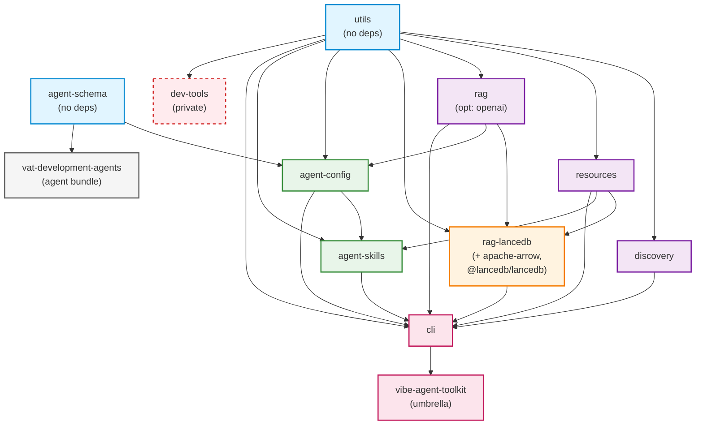

# Vibe Agent Toolkit Packages

This directory contains all packages in the vibe-agent-toolkit monorepo. This README documents each package, its purpose, dependencies, and npm distribution.

## Package Overview

| Package | npm Package | Status | Purpose |
|---------|-------------|--------|---------|
| agent-schema | `@vibe-agent-toolkit/agent-schema` | Published | JSON Schema definitions and TypeScript types for agent manifests |
| utils | `@vibe-agent-toolkit/utils` | Published | Core utility functions (no internal dependencies) |
| discovery | `@vibe-agent-toolkit/discovery` | Published | Intelligent file discovery for agents and Claude Skills |
| resources | `@vibe-agent-toolkit/resources` | Published | Markdown resource parsing, validation, and link integrity |
| rag | `@vibe-agent-toolkit/rag` | Published | Abstract RAG interfaces and shared implementations |
| rag-lancedb | `@vibe-agent-toolkit/rag-lancedb` | Published | LanceDB implementation of RAG interfaces |
| agent-config | `@vibe-agent-toolkit/agent-config` | Published | Agent manifest loading and validation |
| agent-skills | `@vibe-agent-toolkit/agent-skills` | Published | Build and package VAT agents as Claude Skills |
| cli | `@vibe-agent-toolkit/cli` | Published | Command-line interface (provides `vat` binary) |
| vat-development-agents | `@vibe-agent-toolkit/vat-development-agents` | Published | VAT development agents (agent bundle) |
| vibe-agent-toolkit | `vibe-agent-toolkit` | Published | Umbrella package (installs everything) |
| dev-tools | `@vibe-agent-toolkit/dev-tools` | **Private** | Development tools for the monorepo |

## Dependency Graph

The packages follow a progressive dependency structure from low-level utilities to high-level orchestration:



## Package Details

### Foundation Layer

#### agent-schema
**npm**: `@vibe-agent-toolkit/agent-schema`

JSON Schema definitions and TypeScript types for VAT agent manifest format. Uses Zod for type-safe schema definitions that generate both TypeScript types and JSON Schema.

**Dependencies**:
- External: `zod`, `zod-to-json-schema`
- Internal: None

**Exports**:
- TypeScript types derived from Zod schemas
- Generated JSON Schema files in `schemas/` directory

---

#### utils
**npm**: `@vibe-agent-toolkit/utils`

Core utility functions with minimal external dependencies. Provides cross-platform file operations, process spawning, path handling, and gitignore support. This package has no internal dependencies by design - all other packages can depend on it safely.

**Dependencies**:
- External: `ignore`, `picomatch`, `which`
- Internal: None

---

### File & Resource Layer

#### discovery
**npm**: `@vibe-agent-toolkit/discovery`

Intelligent file discovery for VAT agents and Claude Skills. Finds agent manifests, skill files, and resources with pattern matching and gitignore support.

**Dependencies**:
- External: `picomatch`
- Internal: `utils`

---

#### resources
**npm**: `@vibe-agent-toolkit/resources`

Markdown resource parsing, validation, and link integrity checking. Parses markdown files using remark, validates internal links and anchors, detects broken references.

**Dependencies**:
- External: `picomatch`, `remark-frontmatter`, `remark-gfm`, `remark-parse`, `unified`, `unist-util-visit`, `zod`
- Internal: `utils`

---

### RAG Layer

#### rag
**npm**: `@vibe-agent-toolkit/rag`

Abstract RAG (Retrieval-Augmented Generation) interfaces and shared implementations. Provides chunking strategies, embedding providers (local and OpenAI), and abstract RAG provider interface.

**Dependencies**:
- External: `@xenova/transformers`, `gpt-tokenizer`, `zod`, `zod-to-json-schema`
- External (optional): `openai`
- Internal: `resources`, `utils`

---

#### rag-lancedb
**npm**: `@vibe-agent-toolkit/rag-lancedb`

LanceDB implementation of RAG interfaces for vibe-agent-toolkit. Provides vector storage and similarity search using LanceDB with Apache Arrow for efficient data handling.

**Dependencies**:
- External: `@lancedb/lancedb`, `apache-arrow`
- Internal: `rag`, `resources`, `utils`

**Note**: Requires `apache-arrow@18.1.0` for compatibility with `@lancedb/lancedb@0.23.0` and Bun runtime.

---

### Configuration & Runtime Layer

#### agent-config
**npm**: `@vibe-agent-toolkit/agent-config`

Agent manifest loading and validation. Loads agent YAML manifests, validates against JSON Schema, resolves file paths, and provides typed access to agent configuration.

**Dependencies**:
- External: `yaml`
- Internal: `agent-schema`, `utils`, `rag`

---

#### agent-skills
**npm**: `@vibe-agent-toolkit/agent-skills`

Build and package VAT agents as Claude Skills. Converts VAT agent manifests to Claude Skill format, bundles resources, generates JSON Schema from Zod definitions, and produces installable skill packages.

**Dependencies**:
- External: `yaml`, `zod`, `zod-to-json-schema`
- Internal: `agent-config`, `resources`, `utils`

---

### CLI & Distribution Layer

#### cli
**npm**: `@vibe-agent-toolkit/cli`

Command-line interface for vibe-agent-toolkit. Provides the `vat` binary for building, validating, and managing VAT agents.

**Binary**: `vat`

**Commands**:
- `vat agent build` - Build agents for target runtimes
- `vat agent validate` - Validate agent manifests
- `vat resources scan` - Discover markdown resources
- `vat resources validate` - Validate markdown resources
- `vat audit` - Audit Claude plugins and marketplace
- `vat doctor` - Diagnostic checks for VAT environment

**Dependencies**:
- External: `@anthropic-ai/sdk`, `commander`, `js-yaml`, `semver`, `zod`
- Internal: `agent-config`, `discovery`, `rag`, `rag-lancedb`, `resources`, `agent-skills`, `utils`

**Note**: The CLI is a "dumb orchestrator" - it coordinates other packages but contains minimal business logic itself.

---

#### vibe-agent-toolkit
**npm**: `vibe-agent-toolkit`

Umbrella package that installs everything. This is the simplest way for users to get started with VAT - it provides the complete toolkit including the `vat` CLI.

**Binary**: `vat` (via dependency on `@vibe-agent-toolkit/cli`)

**Dependencies**:
- Internal: `cli` (which transitively pulls in all other packages)

**Installation**:
```bash
npm install -g vibe-agent-toolkit    # Everything
npm install -g @vibe-agent-toolkit/cli  # Just CLI
```

---

### Agent Bundles

#### vat-development-agents
**npm**: `@vibe-agent-toolkit/vat-development-agents`

VAT development agents - dogfooding the vibe-agent-toolkit. Contains example agents built using VAT, demonstrating best practices and serving as development tools for the toolkit itself.

**Type**: `agent-bundle`

**Agents**:
- `agent-generator` - Generate new VAT agents
- `resource-optimizer` - Optimize resource usage

**Dependencies**:
- External: `yaml`
- Internal: `agent-schema`

---

### Development Tools (Private)

#### dev-tools
**Package**: `@vibe-agent-toolkit/dev-tools` (NOT PUBLISHED)

Development tools for the monorepo. Contains scripts for version bumping, pre-publish checks, CLI documentation generation, and other build-time utilities.

**Status**: Private (not published to npm)

**Dependencies**:
- External: `semver`, `which`
- Internal: `utils`

**Scripts**:
- `bump-version.ts` - Unified version management
- `pre-publish-check.ts` - Pre-publish validation
- `generate-cli-docs.ts` - Generate CLI documentation
- `prepare-bin.ts` - Prepare CLI binary for publication

---

## Installation

See the [root README](../README.md) for installation instructions for end users, package consumers, and contributors.

## Versioning

All packages in this monorepo share the same version number (unified versioning). When any package changes, all packages are bumped together. This ensures compatibility and simplifies dependency management.

**Current version**: See individual package.json files or run `vat --version`

## Publishing

Packages are published to npm with the `@vibe-agent-toolkit` scope, except for:
- `vibe-agent-toolkit` (unscoped umbrella package)
- `@vibe-agent-toolkit/dev-tools` (private, not published)

Publishing is automated via GitHub Actions when version tags are pushed.

## More Information

- [Root README](../README.md) - Project overview
- [Architecture Docs](../docs/architecture/README.md) - Detailed architecture
- [CLAUDE.md](../CLAUDE.md) - Development guidelines
